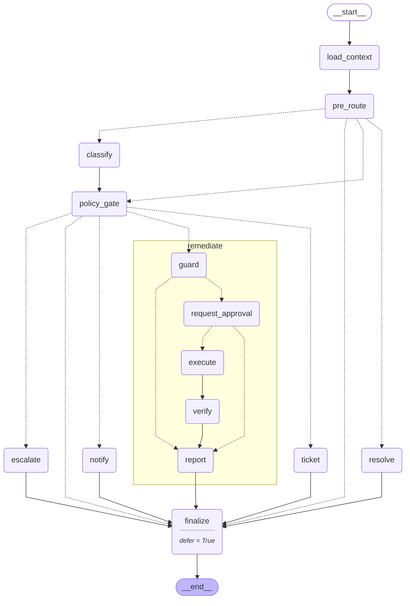

# Triage graph

Generated by `uv run opstriage-triage --draw-graph docs/triage-graph.mmd` (spec 12.2.8 DoD).

```mermaid
---
config:
  flowchart:
    curve: linear
---
graph TD;
	__start__([<p>__start__</p>]):::first
	load_context(load_context)
	pre_route(pre_route)
	classify(classify)
	policy_gate(policy_gate)
	notify(notify)
	ticket(ticket)
	escalate(escalate)
	resolve(resolve)
	finalize(finalize<hr/><small><em>defer = True</em></small>)
	__end__([<p>__end__</p>]):::last
	__start__ --> load_context;
	classify --> policy_gate;
	escalate --> finalize;
	load_context --> pre_route;
	notify --> finalize;
	policy_gate -.-> escalate;
	policy_gate -.-> finalize;
	policy_gate -.-> notify;
	policy_gate -.-> remediate\3aguard;
	policy_gate -.-> ticket;
	pre_route -.-> classify;
	pre_route -.-> finalize;
	pre_route -.-> policy_gate;
	pre_route -.-> resolve;
	remediate\3areport --> finalize;
	resolve --> finalize;
	ticket --> finalize;
	finalize --> __end__;
	subgraph remediate
	remediate\3aguard(guard)
	remediate\3arequest_approval(request_approval)
	remediate\3aexecute(execute)
	remediate\3averify(verify)
	remediate\3areport(report)
	remediate\3aexecute --> remediate\3averify;
	remediate\3aguard -.-> remediate\3areport;
	remediate\3aguard -.-> remediate\3arequest_approval;
	remediate\3arequest_approval -.-> remediate\3aexecute;
	remediate\3arequest_approval -.-> remediate\3areport;
	remediate\3averify --> remediate\3areport;
	end
	classDef default fill:#f2f0ff,line-height:1.2
	classDef first fill-opacity:0
	classDef last fill:#bfb6fc
```
